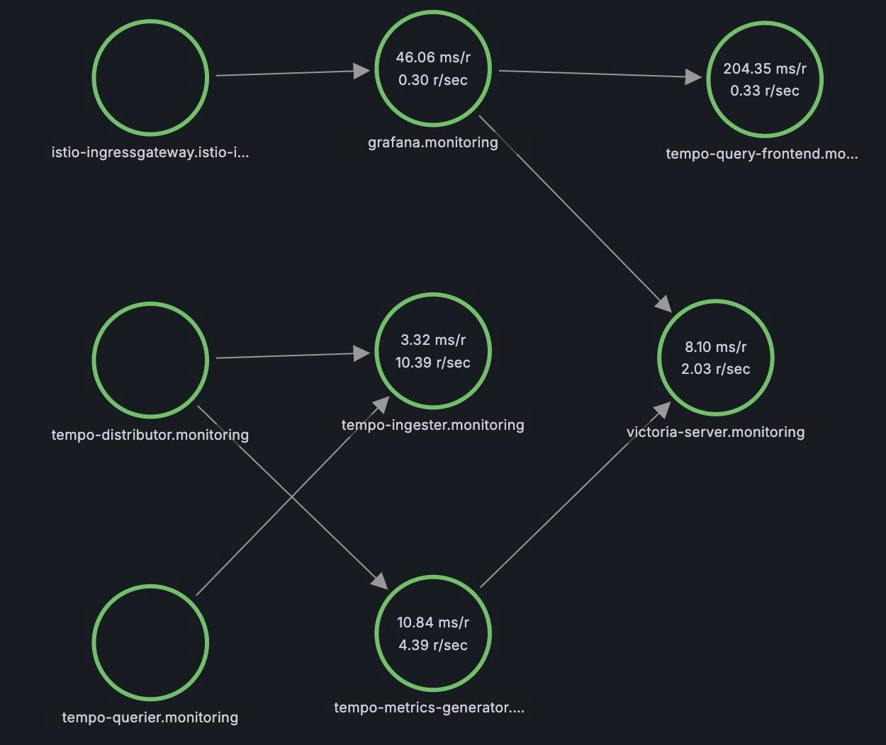

# What

Create cluster with grafana, tempo, victoria metrics, istio and
To discover how spans draws like a service graph in tempo

# Prerequisites

- make
- python3
- [terraform](https://learn.hashicorp.com/tutorials/terraform/install-cli)
- [kind](https://kind.sigs.k8s.io/docs/user/quick-start/)
- [docker](https://docs.docker.com/get-docker/)
- [kubectl](https://kubernetes.io/docs/tasks/tools/install-kubectl/)
- [helm (for manual runs)](https://helm.sh/docs/intro/install/)

# How to run (Github Codespaces)

```bash
make prepare-codespace
make run
curl http://localhost:30080/svc2/proxy
# {"text":"Hello, World!"}
```

# How to check

Check creds in [terraform/values](terraform/values)
Open grafana in browser http://localhost:30080/grafana
Go to "Explore" -> "Service Graph"




# How to destroy cluster

```bash destroy
make destroy
```

# How

we start infrustructure where tempo comes with service metrics-generator, which generates metrics by spans and sends them to victoria-metrics

the go application itelf make spans and sends them to tempo distributor (otel)
on top of that istio tracks down requests from servicer to service and sends them to tempo distributor (zipkin)

[docs](https://grafana.com/docs/tempo/latest/metrics-generator/service_graphs/)

```

```
