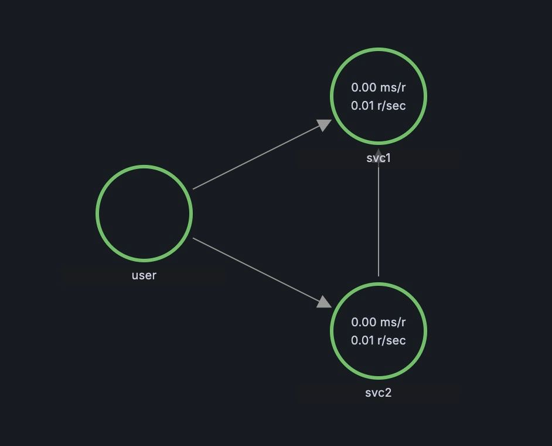

# What

Create cluster with grafana, tempo, victoria metrics
To discover how spans draws like a service graph in tempo

# Prerequisites

- [terraform](https://learn.hashicorp.com/tutorials/terraform/install-cli)
- [kind](https://kind.sigs.k8s.io/docs/user/quick-start/)
- [docker](https://docs.docker.com/get-docker/)
- [kubectl](https://kubernetes.io/docs/tasks/tools/install-kubectl/)

# How to without terraform (TODO)

# How to

```bash
cd terraform
terraform init
terraform apply
docker build -t my-go-app:v0 -f ../ci/Dockerfile ..
kind load docker-image my-go-app:v0 -n demo-local
kubectl create namespace example
kubectl apply -f ../ci/deployment.yaml
curl http://localhost/svc1/hello
# {"text":"Hello, World!"}
curl http://localhost/svc2/hello
# {"text":"Hello, World!"}
open http://localhost/grafana
# check user/pass in [terraform/values](terraform/values)
# "Explore" -> "Service Graph"
```

go and check result in grafana



# How

we start infrustructure where tempo comes with service metrics-generator, which generates metrics by spans

moreover in tempo datasource we use our prometheus-compatible victoria for fetching metrics for service graph

general application
[docs](https://grafana.com/docs/tempo/latest/metrics-generator/service_graphs/)
